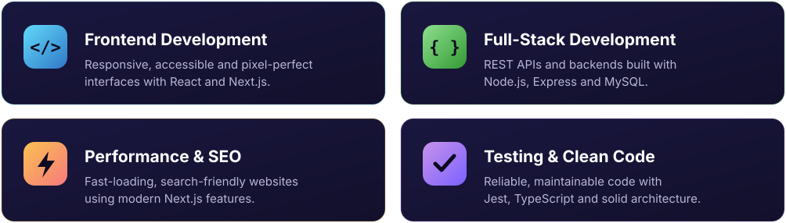

  

  

  
  
  

 

## 👨‍💻 About Me

I'm a **Software Engineer at [Motilal Oswal](https://www.motilaloswal.com)** based in Mumbai, India. I enjoy turning ideas into fast, clean and user-friendly web experiences.

- 🚀 &nbsp;Building modern web apps with **Next.js** and **TypeScript**
- 🎨 &nbsp;Passionate about clean UI, performance and great UX
- 🤖 &nbsp;Exploring **AI-assisted development**
- 💬 &nbsp;Ask me about **React, JavaScript and frontend architecture**
- ⚡ &nbsp;Fun fact: I turn coffee ☕ into components

 

## 🧩 What I Do

  

## 🔭 Currently

  

## 🛠️ Tech Stack

    
    
  

## 📈 GitHub Activity

  

  <picture>
    <source media="(prefers-color-scheme: dark)" srcset="https://raw.githubusercontent.com/moiz-md/moiz-md/output/github-snake-dark.svg" />
    <source media="(prefers-color-scheme: light)" srcset="https://raw.githubusercontent.com/moiz-md/moiz-md/output/github-snake.svg" />
    
  </picture>

## 🤝 Let's Connect

  <i>Whether it's a project, an opportunity or just to say hi — my inbox is always open!</i>

  
  
  

  

